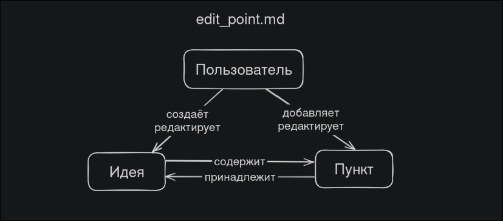
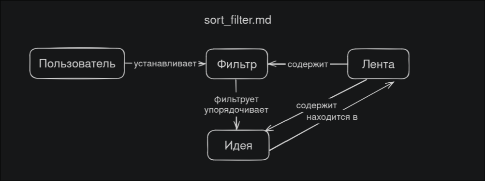
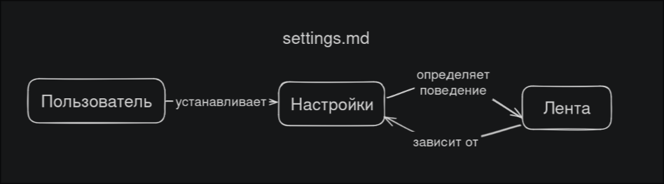
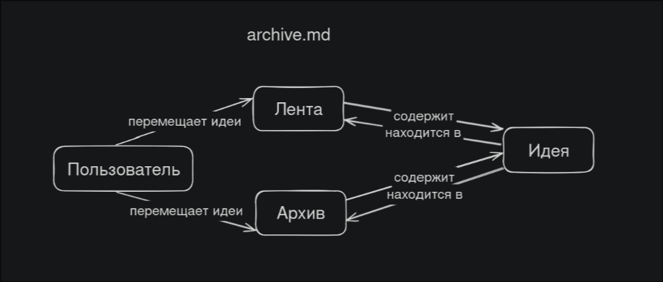

## Объектные диаграммы к проекту
### Каждая диаграмма соответствует пользовательскому сценарию:
1. [edit_idea.md](../../belozerov_user_scripts/edit_idea.md)

2. [edit_point.md](../../belozerov_user_scripts/edit_point.md)

3. [sort_filter.md](../../belozerov_user_scripts/sort_filter.md)

4. [settings.md](../../belozerov_user_scripts/settings.md)

5. [archive.md](../../belozerov_user_scripts/archive.md)

6. [feedback.md](../../belozerov_user_scripts/feedback.md)

