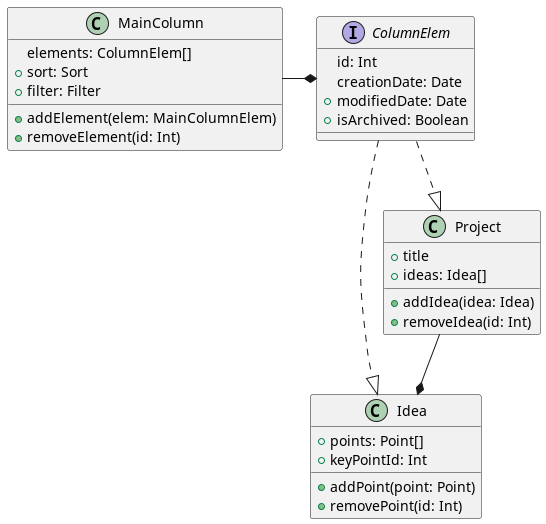
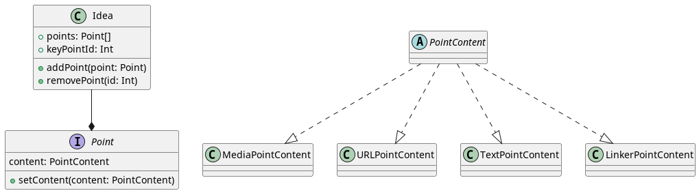
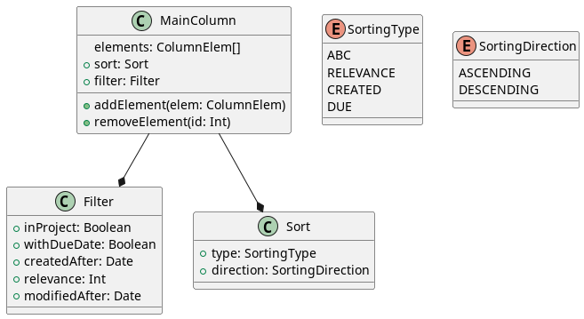
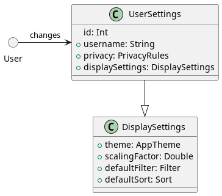
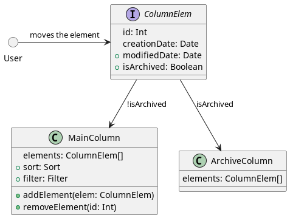
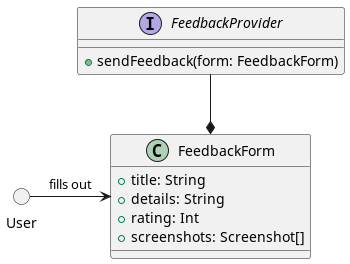

## UML-диаграммы к проекту
### Каждая диаграмма соответствует пользовательскому сценарию:
1. [edit_idea.md](../../belozerov_user_scripts/edit_idea.md)
   _[PlantUML 🌿](./idea.puml)_\
   
2. [edit_point.md](../../belozerov_user_scripts/edit_point.md)
   _[PlantUML 🌿](./point.puml)_\
   
3. [sort_filter.md](../../belozerov_user_scripts/sort_filter.md)
   _[PlantUML 🌿](./sort_filter.puml)_\
   
4. [settings.md](../../belozerov_user_scripts/settings.md)
   _[PlantUML 🌿](./settings.puml)_\
   
5. [archive.md](../../belozerov_user_scripts/archive.md)
   _[PlantUML 🌿](./archive.puml)_\
   
6. [feedback.md](../../belozerov_user_scripts/feedback.md)
   _[PlantUML 🌿](./feedback.puml)_\
   
